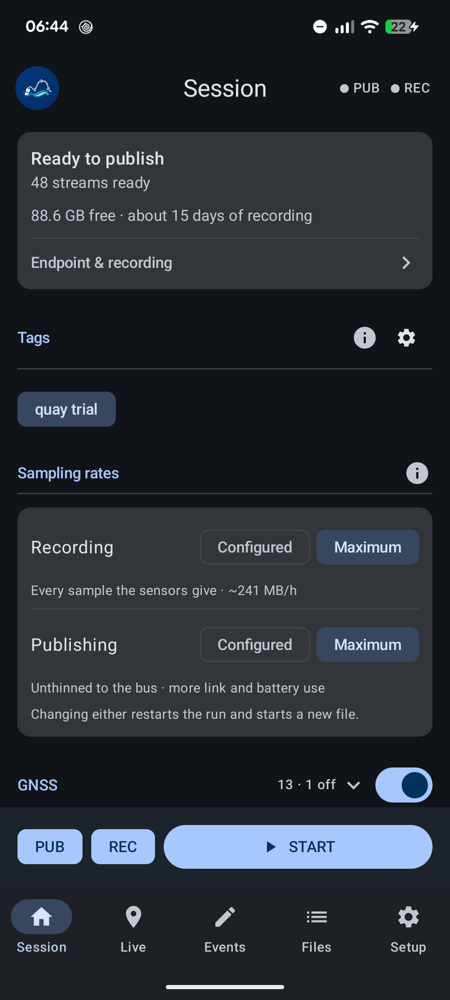
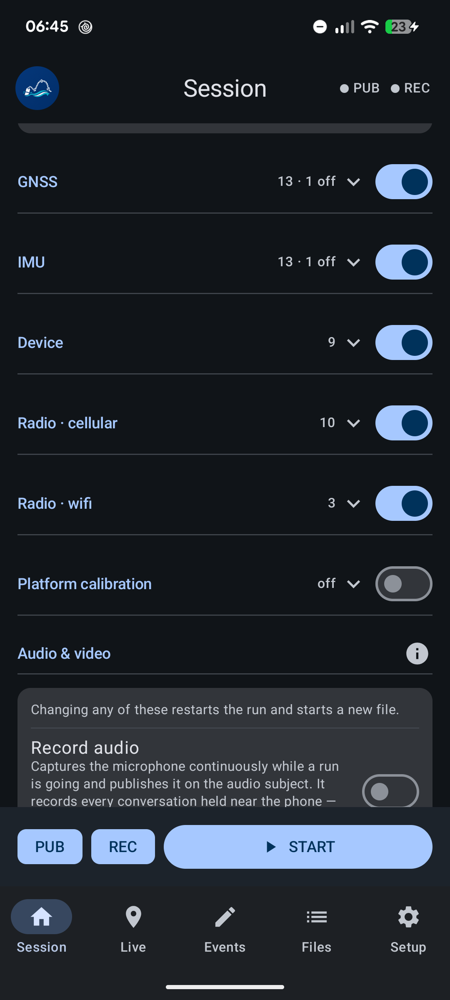
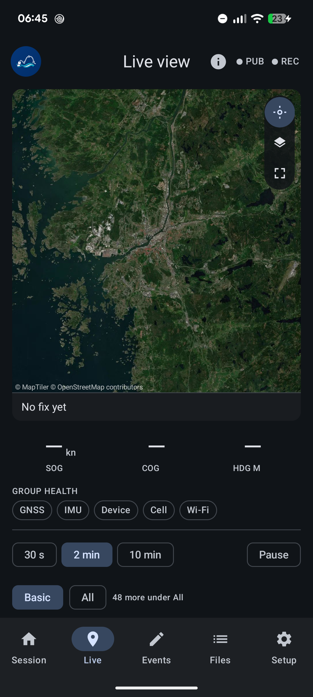
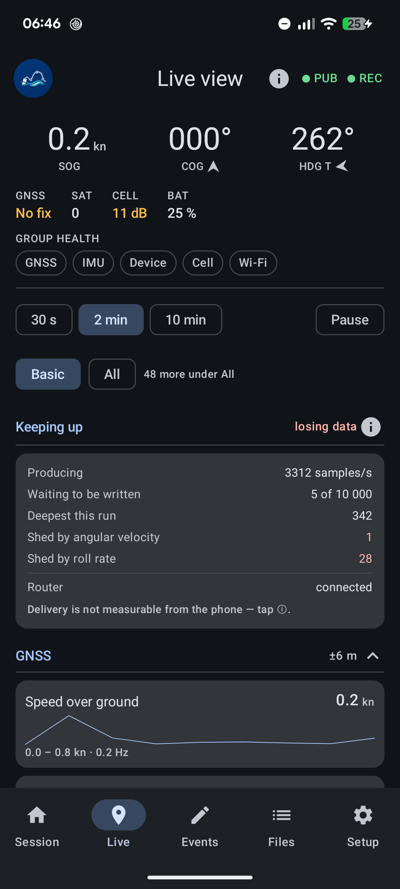
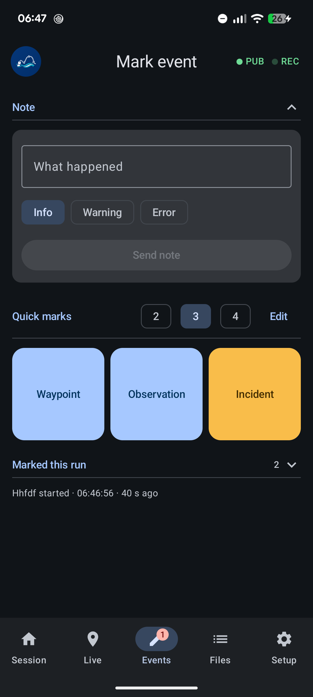
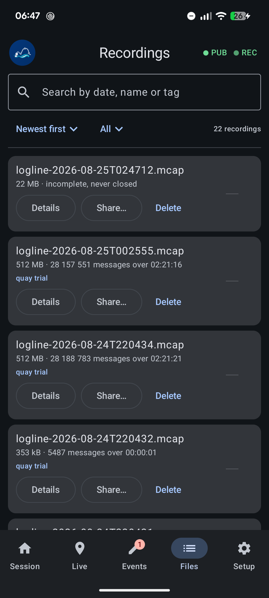

# Logline

**An Android phone as a [Keelson](https://github.com/RISE-Maritime/keelson) sensor connector.**
It reads the phone's GNSS, IMU, barometer, light sensor, battery and radios, publishes them to a
Zenoh router as protobuf wrapped in a Keelson `Envelope`, and writes the same readings to an MCAP
file on the phone. The two halves are independent — either can be switched off.

No backend of its own, no account, no app store. Point it at a router and press START.

## What it looks like

Six screens, in the order a run passes through them. Taken on a Pixel 6;
[docs/user-guide.md](docs/user-guide.md) explains each one in words.

<table>
<tr>
<td align="center" width="33%">
<br>
<sub><b>Session</b> — what a run will do, and the button that starts it</sub>
</td>
<td align="center" width="33%">
<br>
<sub>…and further down it, every subject the phone can publish</sub>
</td>
<td align="center" width="33%">
<br>
<sub><b>Live</b> — the chart, and what it says when there is no fix</sub>
</td>
</tr>
<tr>
<td align="center" width="33%">
<br>
<sub>…scrolled past it, the numbers and whether they are keeping up</sub>
</td>
<td align="center" width="33%">
<br>
<sub><b>Events</b> — a note, or a quick mark held open as a timer</sub>
</td>
<td align="center" width="33%">
<br>
<sub><b>Files</b> — every recording, with its figures and its track</sub>
</td>
</tr>
</table>

## What it does

- **52 Keelson subjects**, from 56 streams — position and fix quality, speed, course, heading,
  attitude and rates, air pressure, light, battery, cellular and Wi-Fi. Audio, time-lapse stills
  and H.264 video are there too, off by default.
- **Records while it publishes.** Every sample also goes to a zstd-chunked MCAP file that lands in
  `Downloads/Logline`, readable by Foxglove and keelson's own replayer.
- **Survives a dropped link.** A Zenoh `put` succeeds with no router listening, so the app holds the
  last couple of minutes of samples and replays them when the router comes back.
- **Says what happened.** Notes and quick marks go on the bus and into the file — tap for an
  instant, hold for an interval.
- **Surveys a platform.** Sensor offsets and rotations, measured or typed, published as
  `frame_transform` under the platform's own entity id.
- **Runs unattended.** A foreground service keeps a run alive with the screen off, through a swipe
  out of recents, and across a reboot.

## Quick start

```bash
export JAVA_HOME="/Applications/Android Studio.app/Contents/jbr/Contents/Home"

./gradlew :app:assembleDebug
adb install -r app/build/outputs/apk/debug/app-debug.apk
```

Out of the box the endpoint is loopback, `tcp/127.0.0.1:7447`, so a fresh install publishes nowhere
until it is pointed at a router — a plain `tcp/` one on your own network needs nothing else, and a
shared `tls/` bus needs three mTLS credentials imported on the phone first. Either way the endpoint
can be typed in, found with **Scan for routers**, or provisioned from a QR code.
See [Connecting to a router](docs/connecting.md).

## Documentation

This file is the front door; everything else is a page of its own.

| | |
| --- | --- |
| [docs/user-guide.md](docs/user-guide.md) | using the app — for whoever is handed the phone |
| [docs/deploying.md](docs/deploying.md) | building, signing, and provisioning a phone |
| [docs/subjects.md](docs/subjects.md) | every subject on the wire, and what each number really means |
| [docs/keys-and-liveliness.md](docs/keys-and-liveliness.md) | the key layout, `@v0`, and the three liveliness tiers |
| [docs/connecting.md](docs/connecting.md) | endpoints, mTLS, replay after an outage, proving it works |
| [docs/settings.md](docs/settings.md) | what is configurable, checklists, platform library |
| [docs/live-view.md](docs/live-view.md) | the chart, its layers, and offline maps |
| [docs/recording.md](docs/recording.md) | the MCAP files, and running unattended |
| [docs/calibration.md](docs/calibration.md) | surveying a platform's geometry, in full |
| [docs/architecture.md](docs/architecture.md) | how the code fits together |
| [docs/development.md](docs/development.md) | requirements, build, project layout, known limitations |
| [CHANGELOG.md](CHANGELOG.md) | what is in a given build |
| [TODO.md](TODO.md) · [CLAUDE.md](CLAUDE.md) | what is pending · how to work on this repo |

Written in Kotlin with Jetpack Compose. Single Gradle module (`:app`), no backend — it is a publisher
on someone else's bus.
